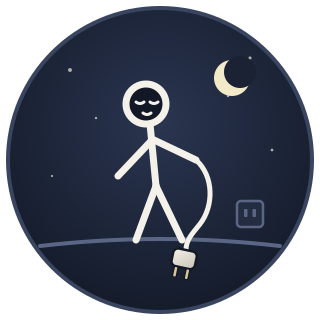

<h1 align="center">Turn Them Off</h1>

<em>A hard, timed block on every LLM you can reach from your Mac. Get some rest.</em>

Work in progress. The daemon, CLI, menu bar app, release pipeline, docs and
website each arrive as a reviewed pull request; watch the log.
